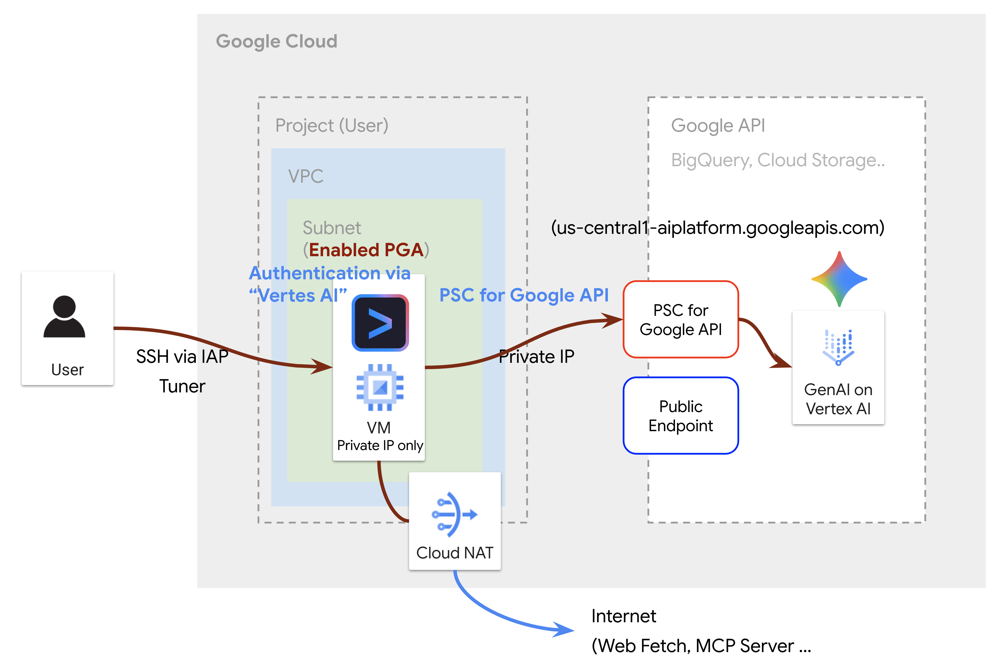
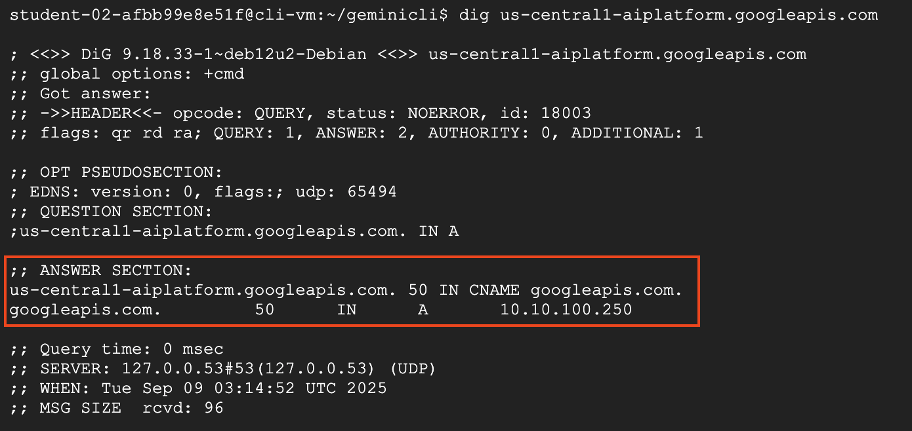
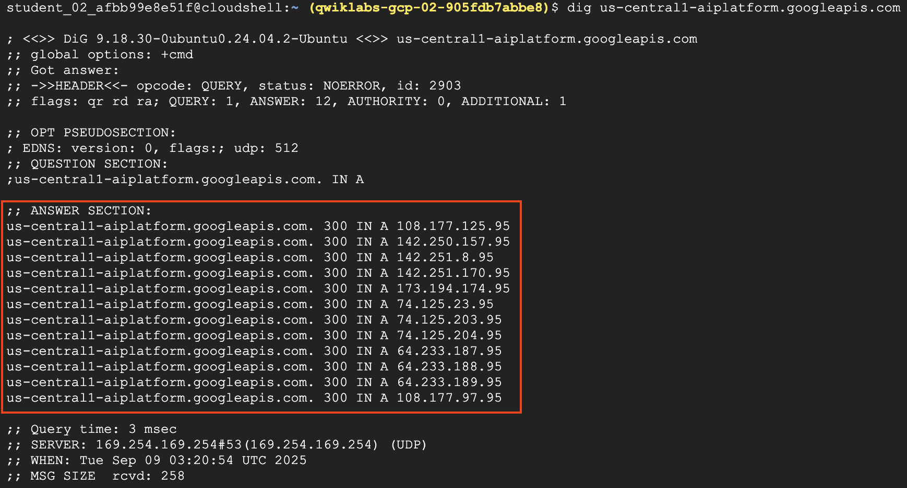
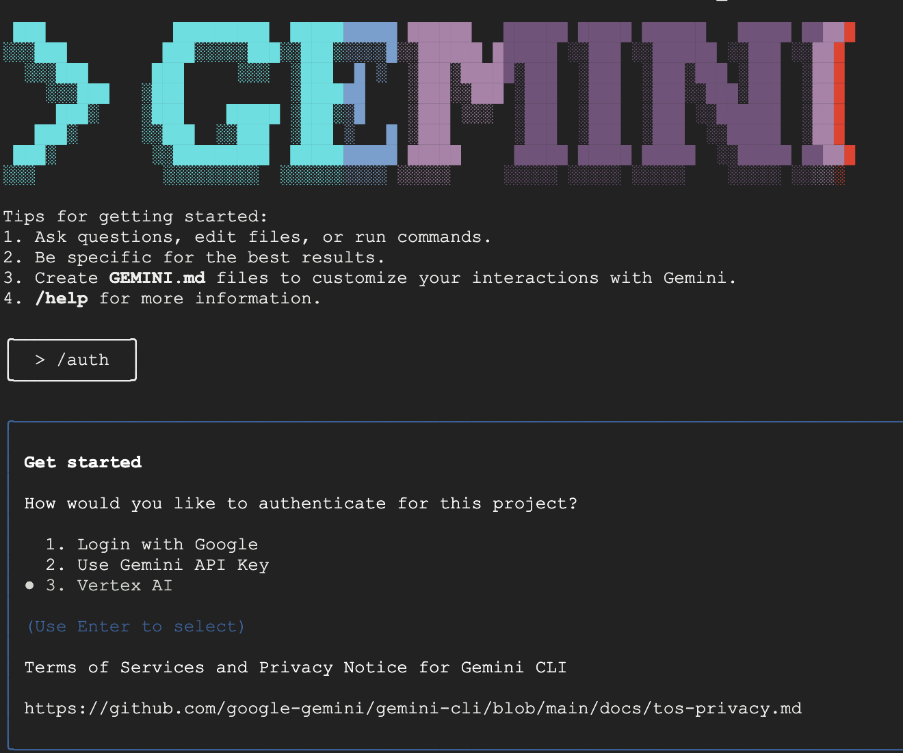

# pga-geminicli



## 0. 환경설정

환경변수 설정
```bash
export PROJECT_ID=         //qwiklabs-gcp-00-90a5c37a7501
export REGION=us-central1
```

terraform.tfvars 파일 업데이트
```bash
sed -i \
-e "s/your-gcp-project-id/$PROJECT_ID/" \
-e "s/your-region/$REGION/" \
terraform.tfvars
```

## 1. Terraform 설치

```bash
terraform init
```
```bash
terraform plan
```
```bash
terraform apply
```

## Terraform 으로 생성되는 리소스
*   **`google_project_service`**: 다음 API를 활성화합니다.
    *   `dns.googleapis.com`
    *   `aiplatform.googleapis.com`
    *   `servicedirectory.googleapis.com`
*   **`google_compute_network`**: `gemini-vpc-net`이라는 이름의 VPC 네트워크를 생성합니다.
*   **`google_compute_subnetwork`**: `vm1-subnet`이라는 이름의 서브넷을 생성합니다. Private Google Access 를 활성화 하여 Gemini 로의 호출을 Private Connection 을 유지합니다.
*   **`google_compute_router`**: `outbound-nat`이라는 이름의 Cloud Router를 생성합니다.
*   **`google_compute_router_nat`**: `outbound-gw`라는 이름의 Cloud NAT 게이트웨이를 생성하여 외부 IP가 없는 VM의 인터넷 액세스를 제어합니다.
*   **`google_compute_instance`**: `cli-vm`이라는 이름의 VM 인스턴스를 생성합니다. 해당 VM 에 Gemini CLI 를 설치합니다.
*   **`google_compute_firewall`**: 
    *   `allow-icmp-gemini-vpc-net` : ICMP 트래픽을 허용하는 방화벽 규칙을 생성합니다.
    *   `allow-ssh-gemini-vpc-net` : SSH 트래픽을 허용하는 방화벽 규칙을 생성합니다.
*   **`google_project_iam_member`**: 서비스 계정에 `roles/compute.instanceAdmin.v1` 및 `roles/iap.tunnelResourceAccessor` 역할을 부여합니다.
*   **`google_compute_global_address`**: `gemini-ip` 라는 이름의 Private Service Connect 용 내부 IP 주소를 생성합니다.
*   **`google_compute_global_forwarding_rule`**: `pscgemini` 라는 이름의 Private Service Connect 전달 규칙을 생성합니다.
*   **`google_dns_managed_zone`**: `googleapis.com`에 대한 `googleapis-private` 라는 이름의 비공개 DNS 영역을 생성합니다.
*   **`google_dns_record_set`**: 
    *   `googleapis.com`에 대한 A 레코드를 생성합니다.
    *   `*.googleapis.com`에 대한 CNAME 레코드를 생성합니다.

## 2. SSH를 통해 VM에 연결

VM은 외부 IP 주소 없이 생성되어, IAP를 통해서만 SSH 로액세스할 수 있습니다.
다음 `gcloud` 명령을 사용하여 VM에 연결합니다.

```bash
gcloud compute ssh cli-vm --zone ${REGION}-c --project $PROJECT_ID
```

## 3. VM 에서 내부 연결로 Gemini 를 호출하는지 확인
```bash
dig us-central1-aiplatform.googleapis.com
```

VM 에서 내부 연결로 Gemini를 호출하는 경우



(참고) VM 에서 인터넷 연결로 Gemini를 호출하는 경우



## 4. Gemini CLI 설치
VM 연결 후 Gemini CLI를 설치

```bash
mkdir geminicli && cd geminicli
```

Node.js 설치 스크립트 다운로드 (Cloud NAT 가 Provisioning 되어 있어 가능)
```bash
curl -fsSL https://deb.nodesource.com/setup_24.x -o nodesource_setup.sh
```
Node.js 설치 스크립트 실행
```bash
sudo -E bash nodesource_setup.sh
```
Node.js 설치
```bash
sudo apt-get install -y nodejs
```
Gemini CLI 를 위한 환경 변수 설정
```bash
export PROJECT_ID=

export REGION=us-central1
cat <<EOF >> ~/.bashrc 
export GOOGLE_CLOUD_PROJECT=${PROJECT_ID}
export GOOGLE_CLOUD_LOCATION=${REGION} 
export GOOGLE_GENAI_USE_VERTEXAI=true
EOF

source ~/.bashrc
```
애플리케이션 기본 인증 설정

```bash
gcloud auth application-default login
```
Gemini CLI 설치
```bash
sudo npm install -g @google/gemini-cli
```

Gemini CLI 실행 ('3. VertexAI 로 인증')
```bash
gemini
```



## 프로젝트 구조

-   `main.tf`: 필요한 Google Cloud API를 활성화합니다.
-   `provider.tf`: Google Cloud provider를 구성합니다.
-   `network.tf`: VPC 네트워크, 서브넷, Cloud Router, Cloud NAT를 정의합니다.
-   `firewall.tf`: ICMP 및 SSH 트래픽을 허용하는 방화벽 규칙을 포함합니다.
-   `vm.tf`: Google Compute Engine VM 인스턴스를 정의합니다.
-   `iam.tf`: 서비스 계정에 대한 IAM 권한을 관리합니다.
-   `psc.tf`: Private Service Connect 관련 리소스 (전역 IP 주소, 전달 규칙)를 정의합니다.
-   `dns.tf`: 비공개 DNS 영역 및 레코드 설정을 정의합니다.
-   `variable.tf`: 프로젝트에 사용된 모든 변수를 포함합니다.
-   `outputs.tf`: Terraform 프로젝트의 출력 값을 정의합니다.
-   `terraform.tfvars`: 변수 값을 설정하는 파일입니다.
